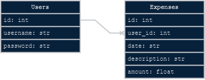

# Step 1

## Setting up the database and .env

### The Schema file

1. Create a .sql file in your module

    ```bash
    touch <repo_root>/restful_budget_api/schema.sql
    ```

2. Open schema.sql and write in SQL to create our two tables

    ```sql
    CREATE TABLE IF NOT EXISTS users (
      id INTEGER PRIMARY KEY AUTOINCREMENT,
      username TEXT UNIQUE NOT NULL,
      password TEXT NOT NULL,
      UNIQUE (username)
    );

    CREATE TABLE IF NOT EXISTS expenses (
      id INTEGER PRIMARY KEY AUTOINCREMENT,
      user_id INTEGER NOT NULL,
      date TEXT NOT NULL,
      description TEXT NOT NULL,
      amount REAL NOT NULL,
      FOREIGN KEY(user_id) REFERENCES user(id)
    );
    ```

### The DB file

1. Create the dbs directory

    ```bash
    mkdir <repo_root>/dbs
    ```

2. Launch sqlite3 and create the actual db file

    ```bash
    sqlite3 <repo_root>/dbs/demo.db
    ```

3. From your sqlite3 session, run the schema file

    ```sql
    .read <repo_root>/restful_budget_api/schema.sql
    ```

4. Create a dummy user with a ~dangerously~ simple password (will be helpful for dev later)

    ```sql
    INSERT INTO users (username, password) VALUES ("tester", "1234");
    SELECT * FROM users;
    .exit
    ```

### The Env file

1. Create a local .env with the path to your demo.db

    ```bash
    echo "DEMO_DB='${PWD}/dbs/demo.db'" > <repo_root>/.env
    ```

## db_context

1. Create a directory at `<repo_root>/restful_budget_api/library` and place a `db_context.py` file.

2. Write a `make_db` function that will read a file path and a schema file to make a sqlite db.

    ```python
    import sqlite3
    import os

    def make_db(db_file: str, schema_file: str = "") -> None:
        """execute a schema file to make a db

        :param db_file: absolute path to db file 
        :param schema_file: absolute path to SQL schema file (leaves db empty if null string)
        """
        if not os.path.exists(os.path.dirname(db_file)):
            os.makedirs(os.path.dirname(db_file))
        db_client = sqlite3.connect(db_file)
        if schema_file:
            with open(schema_file, "r", encoding="utf-8") as schema:
                db_client.executescript(schema.read())
        db_client.close()
    ```


## Summary

1. We wrote a SQL file and used it to create an empty database with a one-to-many relationship between user records and the user_id property of expense records:

    

2. We created a dummy user names tester with a password of 1234

3. We added the absolute path of our database to a .env file so Python can find the DB without a need to commit any private info from our path to the repo

4. We added our first Python function to help us create db files in the future
